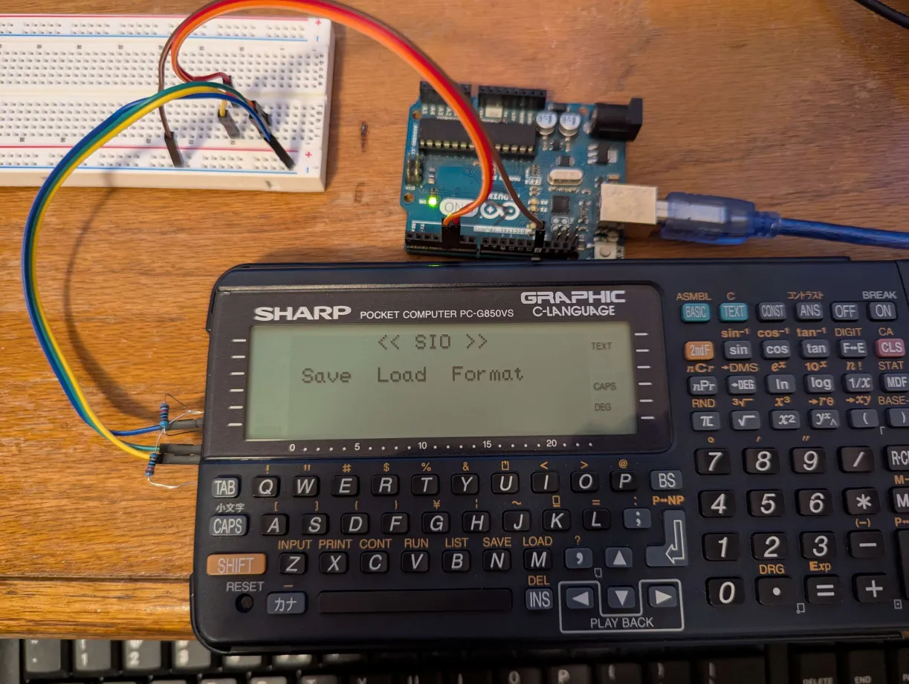

SHARP PC-G850 file loader for arduino uno/nano

```
 *  GND (pin 3) __________________ GND
 * 
 * Rx (pin 6)  __________________ GPIO4
 * 
 * Tx (pin 7)  __________________ GDIO5
 * 
 * RTS (pin 4) __________
 *                       |
 * CTS (pin 9) __________+
 *                       |
 * +5V         ---[10K]--+
 ```

 


Based on this https://github.com/chrisherman/PC-G850V-InvertedSerial/

build loader and save with ./loader/build.sh

use <load/save>_ez for auto line numbers, _raw for you doing the line numbers

save files with `save_ez filename.txt`

load them with `load_ez filename.txt`